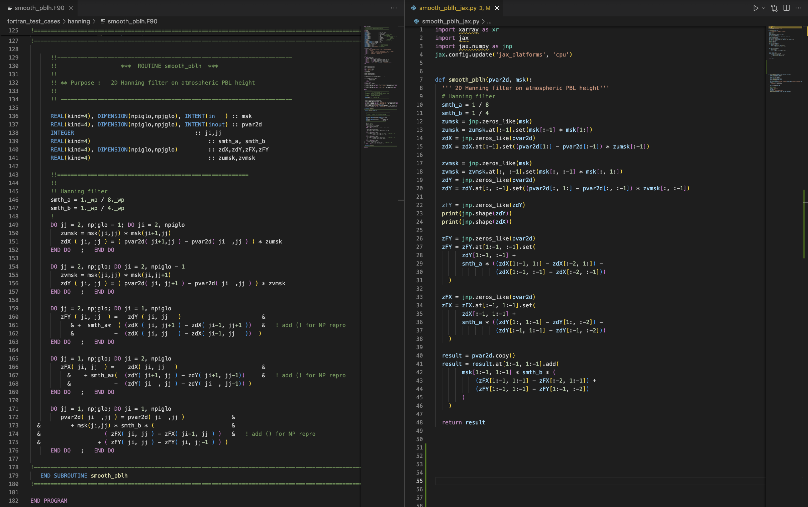

# ABL_1D_JAX
The ABL_1D_JAX project as part of the 2025 IGE Jaxathon. This repo contains our roadmap for a potential translation of the ABL-1D model from Fortran to Jax, scripts for a small test case, in Fortran, Python and Jax and potential recommandations. 

# 📚 Contents of ABL model
- [abl_analysis.md](abl_analysis.md): description of abl_analysis fortran code
- [ablmod_analysis.md](ablmod_analysis.md): description of ablmod_analysis fortran code
- [par_abl_analysis.md](par_abl_analysis.md): description of parbal_analysis fortran code
- [sbcabl_analysis.md](sbcabl_analysis.md): description of sbcabl_analysis fortran code

# ⛳️ Test Case
In order to validate the first function translation (Hanning 2D filter computation), we extract this function from the ABL code in Fortran (code in [`fortran_test_cases`](fortran_test_cases/hanning/README.md).

We then translate this function in both python and JAX (running either on GPUs and CPUs)

For the test case we compute the Hanning Filter on boundary layer height from ERA5

## 🚀 Jax implementation

The environment to install the libraries necessary for the test case in Jax and visualization notebook [`hanning_gpu_vs_cpu.ipynb`](hanning_jax_vs_fortran.ipynb) can be installed with the [`jax.yaml`](jax.yaml) environment file.

`conda env create -f jax.yaml`

The [`smooth_pblh_jax.py`](smooth_pblh_jax.py) code contains the JAX script. 

## 💻 Code line-by-line comparison

The main work was to transform nested loops into matrix operations in python.

# 🆘 Conclusion from the project

The person doing this translation will need solid knowledge of Fortran and especially NEMO convention and functions. Why people do double loops in (x, y) dimension ordering the indexes like (y_min, y_max, x_min, x_max)... 

## 💡 ABL in JAX
The set of initial equations in a single-column approach could be written more directly in JAX.
There is a set of vertical diffusion equation

TKE closure

